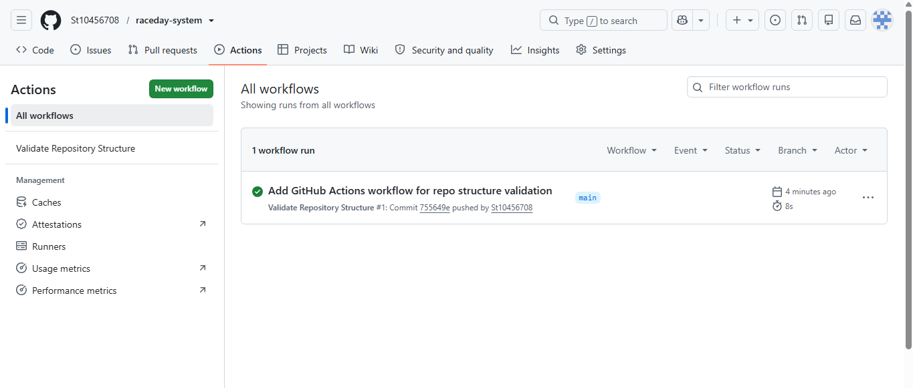

# RaceDay — Event Management System

## System Description

RaceDay is a full-stack, web-based event management system built for the South African road running, walking, and cycling community. The platform allows Event Organisers to create and manage events, categories, and participant results, while Participants can browse upcoming events, enter events, track their personal performance history, and prepare for race day using live weather and route information.

This repository contains Part 1 of the project: system planning and database design, completed before any application code was written.

## Roles

- **Organiser** — creates and manages events, defines race categories (e.g. distance, price), and captures participant results after each event.
- **Participant** — browses upcoming events, enrols in race categories, and views their personal enrolment and results history.

## Repository Structure

raceday-system/
├── docs/
│ ├── erd.png # Entity Relationship Diagram
│ ├── api-endpoint-plan.md # Full API endpoint plan
│ ├── raceday-schema.sql # SQL Server database creation script
│ └── ci-success.png # Screenshot of a successful CI run
├── .github/workflows/
│ └── validate-structure.yml # CI workflow validating repo structure
└── README.md

## Database Design

The RaceDay data model consists of six entities: Users, Events, Venues, Categories, Enrolments, and Results. Full details, including primary keys, foreign keys, and cardinality, are documented in `docs/erd.png`. The corresponding schema is implemented in `docs/raceday-schema.sql` and matches the ERD exactly.

## API Plan

The full REST API endpoint plan — covering authentication, user profiles, events, categories, event enrolments, and results — is documented in `docs/api-endpoint-plan.md`.

## Continuous Integration

A GitHub Actions workflow (`.github/workflows/validate-structure.yml`) runs on every push to confirm the `/docs` folder and all required planning documents are present.

## Video Walkthrough

Watch the full planning walkthrough here: [YouTube link](PASTE_YOUR_UNLISTED_YOUTUBE_LINK_HERE)

The video covers: the ERD design decisions, the API endpoint plan choices, the SQL script design, and a live run of the SQL script in SQL Server Management Studio (SSMS).